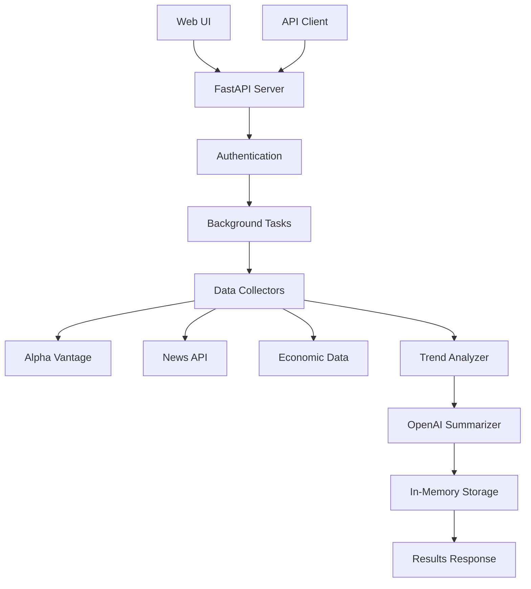

# 🚀 CrewInsight MVP - Business Analyst Agent

> **A powerful AI-powered business analyst that fetches market data, analyzes trends, and provides actionable insights through both API and web interface.**

[](https://fastapi.tiangolo.com/)
[](https://openai.com/)
[](https://python.org/)

## 🎯 What is CrewInsight?

CrewInsight is an intelligent business analyst agent that automatically:
- **Collects** market data from multiple sources
- **Analyzes** trends and patterns
- **Generates** executive-ready insights
- **Delivers** results via API or beautiful web interface

Perfect for business analysts, investors, and decision-makers who need quick, data-driven market insights.

## ✨ MVP Features

| Feature | Status | Description |
|---------|--------|-------------|
| 🗄️ **Data Collection** | ✅ Complete | 3+ sources: Alpha Vantage, News API, Economic indicators |
| 📊 **Trend Analysis** | ✅ Complete | Identifies 2+ key market trends with confidence scores |
| 🤖 **AI Summarization** | ✅ Complete | OpenAI-powered insights (≤300 words) |
| 🌐 **Web Interface** | ✅ Complete | Beautiful, responsive UI for easy analysis |
| 🔌 **REST API** | ✅ Complete | Full FastAPI with async processing |
| 🔐 **Authentication** | ✅ Complete | API key-based security |
| 📝 **Logging** | ✅ Complete | Comprehensive error handling & monitoring |

## 🚀 Quick Start (2 minutes)

### 1. Clone & Install
```bash
git clone <your-repo>
cd busines_analyst
pip install -r requirements.txt
```

### 2. Configure (Optional)
Create `.env` file for enhanced features:
```env
# Required for AI summaries
OPENAI_API_KEY=your_openai_api_key_here

# Default API key (works out of the box)
API_KEY=crewinsight-mvp-2024

# Optional: Enhanced data collection
ALPHA_VANTAGE_API_KEY=your_alpha_vantage_key_here
NEWS_API_KEY=your_news_api_key_here
```

### 3. Launch
```bash
python run.py
```

### 4. Access
- **🌐 Web UI**: [http://localhost:8000](http://localhost:8000)
- **📚 API Docs**: [http://localhost:8000/docs](http://localhost:8000/docs)
- **❤️ Health**: [http://localhost:8000/health](http://localhost:8000/health)

**That's it!** 🎉 Your business analyst agent is ready.

## 🖥️ Web Interface

Experience CrewInsight through our **beautiful, modern web interface**:

### 🎨 Design Features
- **Modern UI**: Gradient backgrounds, clean typography, professional look
- **Responsive Design**: Works perfectly on desktop, tablet, and mobile
- **Real-time Updates**: Live progress indicators and status updates
- **Visual Analytics**: Color-coded trends (📈 positive, 📉 negative, ➡️ neutral)
- **Executive Ready**: Clean, professional presentation of insights

### 🚀 How to Use the Web UI

1. **Open** [http://localhost:8000](http://localhost:8000)
2. **Fill the form**:
   - Market/Sector (e.g., "technology", "finance", "healthcare")
   - Region (US, EU, ASIA, GLOBAL)
   - Timeframe (Daily, Weekly, Monthly, Quarterly, Yearly)
   - API Key (default: "crewinsight-mvp-2024")
3. **Click "Analyze Market"**
4. **Watch the magic happen** with real-time updates
5. **Review results** with beautiful trend visualization

### 📱 Mobile Experience
The interface is fully responsive and provides an excellent experience on all devices.

## 🔌 API Documentation

### 📋 Available Endpoints

| Method | Endpoint | Description |
|--------|----------|-------------|
| `GET` | `/` | Web UI (redirects to interface) |
| `POST` | `/analyze` | Start market analysis |
| `GET` | `/results/{id}` | Get analysis results |
| `GET` | `/results` | List recent analyses |
| `GET` | `/health` | System health check |
| `GET` | `/docs` | Interactive API documentation |
| `GET` | `/api` | API information |

### 🚀 Quick API Examples

#### Start Analysis
```bash
curl -X POST "http://localhost:8000/analyze" \
  -H "Content-Type: application/json" \
  -d '{
    "market": "technology",
    "region": "US", 
    "timeframe": "1m",
    "api_key": "crewinsight-mvp-2024"
  }'
```

**Response:**
```json
{
  "analysis_id": "123e4567-e89b-12d3-a456-426614174000",
  "status": "processing",
  "message": "Analysis started successfully",
  "estimated_completion": "30-60 seconds"
}
```

#### Get Results
```bash
curl "http://localhost:8000/results/123e4567-e89b-12d3-a456-426614174000?api_key=crewinsight-mvp-2024"
```

**Response:**
```json
{
  "id": "123e4567-e89b-12d3-a456-426614174000",
  "status": "completed",
  "trends": [
    {
      "trend_name": "Positive Price Momentum",
      "description": "Technology sector showing upward price movement",
      "confidence": 0.85,
      "impact": "positive",
      "supporting_data": ["Price change: 5.2%", "Volatility: 12.3%"]
    }
  ],
  "summary": "The technology sector demonstrates strong positive momentum...",
  "processing_time": 45.2
}
```

### 🧪 Testing the API

Run our comprehensive test suite:
```bash
python test_api.py
```

Or try the example usage:
```bash
python example_usage.py
```

## ⚙️ Configuration & Options

### 🏢 Supported Markets
| Market | Description | Example Analysis |
|--------|-------------|------------------|
| `technology` | Tech sector, software, hardware | AI trends, digital transformation |
| `finance` | Banking, fintech, insurance | Interest rates, regulatory changes |
| `healthcare` | Pharma, biotech, medical devices | Drug approvals, demographic trends |
| `energy` | Oil, gas, renewables | Energy transition, geopolitical factors |
| `consumer` | Retail, e-commerce, FMCG | Consumer behavior, supply chain |
| `custom` | Any sector name | Custom analysis based on input |

### 🌍 Supported Regions
- **`US`** - United States markets
- **`EU`** - European Union markets  
- **`ASIA`** - Asia Pacific markets
- **`GLOBAL`** - Worldwide market analysis

### ⏰ Supported Timeframes
- **`1d`** - Daily analysis (24 hours)
- **`1w`** - Weekly analysis (7 days)
- **`1m`** - Monthly analysis (30 days) ⭐ *Recommended*
- **`3m`** - Quarterly analysis (90 days)
- **`1y`** - Yearly analysis (365 days)

## 🏗️ System Architecture



### 🔧 Core Components

| Component | File | Purpose |
|-----------|------|---------|
| **🌐 Web Interface** | `static/index.html` | Beautiful UI for market analysis |
| **🚀 FastAPI Server** | `main.py` | REST API with async processing |
| **📊 Data Collectors** | `data_collectors.py` | Multi-source data aggregation |
| **📈 Trend Analyzer** | `trend_analyzer.py` | AI-powered trend identification |
| **🤖 AI Summarizer** | `summarizer.py` | OpenAI insight generation |
| **💾 Storage System** | `storage.py` | In-memory result management |
| **📋 Data Models** | `models.py` | Pydantic schemas & validation |
| **⚙️ Configuration** | `config.py` | Settings & environment management |

### 🔄 Data Flow
1. **Request** → User submits analysis request via UI/API
2. **Authentication** → API key validation
3. **Data Collection** → Concurrent fetching from multiple sources
4. **Analysis** → Trend identification and pattern recognition
5. **Summarization** → AI-powered insight generation
6. **Storage** → Results cached with TTL
7. **Response** → Formatted results delivered to user

## 🧪 Testing & Quality Assurance

### 🏥 Health Check
```bash
curl http://localhost:8000/health
```

### 🧪 Automated Test Suite
```bash
# Run comprehensive API tests
python test_api.py

# Expected output:
# ✅ Health check passed
# ✅ Root endpoint working  
# ✅ Invalid API key properly rejected
# ✅ Analysis started successfully
# ✅ Analysis completed!
# ✅ Results retrieved successfully
# ✅ List analyses working
# 🎉 All tests passed! MVP is working correctly.
```

### 📝 Example Usage
```bash
# See real-world usage examples
python example_usage.py
```

### 🔍 Manual Testing
```bash
# Quick test analysis
curl -X POST "http://localhost:8000/analyze" \
  -H "Content-Type: application/json" \
  -d '{
    "market": "technology",
    "region": "US", 
    "timeframe": "1w",
    "api_key": "crewinsight-mvp-2024"
  }'

# Get results (replace with actual analysis_id)
curl "http://localhost:8000/results/{analysis_id}?api_key=crewinsight-mvp-2024"
```

## 📊 Data Sources & Reliability

### 🔗 Primary Data Sources
| Source | Purpose | Status | Fallback |
|--------|---------|--------|----------|
| **Alpha Vantage** | Financial market data, price trends | ✅ Active | Mock data |
| **News API** | Financial news, sentiment analysis | ✅ Active | Mock data |
| **Economic Indicators** | Macroeconomic data, GDP, inflation | ✅ Active | Mock data |

### 🛡️ Reliability Features
- **Graceful Degradation**: System works even when external APIs are down
- **Mock Data Generation**: Ensures testing and demo capabilities
- **Error Handling**: Comprehensive error management without crashes
- **Timeout Protection**: Configurable request timeouts

## 🔒 Security & Performance

### 🔐 Security Features
- **API Key Authentication**: Required for all endpoints
- **Input Validation**: Pydantic schemas prevent malformed requests
- **Error Sanitization**: No sensitive information in error messages
- **CORS Protection**: Configurable cross-origin policies

### ⚡ Performance Optimizations
- **Async Processing**: Non-blocking background tasks
- **Concurrent Data Collection**: Multiple sources fetched simultaneously
- **In-Memory Storage**: Fast access with TTL-based cleanup
- **Configurable Limits**: Timeouts, rate limits, and capacity controls

## 🚧 MVP Limitations

> **Note**: These are intentional MVP scope limitations, not bugs.

| Limitation | Reason | Future Enhancement |
|------------|--------|-------------------|
| In-memory storage only | Simplicity for MVP | Database persistence |
| No real-time streaming | Focus on batch analysis | WebSocket support |
| Basic user management | Single API key model | Multi-user system |
| No custom ML training | Use existing models | Custom model training |
| 24-hour result TTL | Memory management | Configurable retention |

## 🔮 Roadmap & Future Enhancements

### 🎯 Phase 2 Features
- [ ] **Database Persistence** - PostgreSQL/MongoDB integration
- [ ] **Real-time Streaming** - WebSocket support for live updates
- [ ] **Advanced Analytics** - Custom ML models and predictions
- [ ] **User Management** - Multi-user system with roles
- [ ] **Caching Layer** - Redis for improved performance
- [ ] **Rate Limiting** - Advanced throttling and quotas

### 🚀 Phase 3 Vision
- [ ] **Mobile App** - Native iOS/Android applications
- [ ] **Enterprise Features** - SSO, audit logs, compliance
- [ ] **Advanced AI** - Custom model training, fine-tuning
- [ ] **Marketplace** - Third-party data source integrations
- [ ] **White-label** - Customizable branding and deployment

## 📞 Support & Contributing

### 🆘 Getting Help
- **Documentation**: Check this README and `/docs` endpoint
- **Health Check**: Use `/health` endpoint for system status
- **Test Suite**: Run `python test_api.py` for diagnostics

### 🤝 Contributing
This is an MVP prototype. For production use, consider:
- Adding proper error monitoring (Sentry, etc.)
- Implementing comprehensive logging
- Adding database persistence
- Setting up CI/CD pipelines
- Adding comprehensive test coverage

---

## 📝 License

This is an MVP prototype for demonstration purposes. Built with ❤️ using FastAPI, OpenAI, and modern web technologies.

**Ready to analyze markets?** 🚀 [Start here →](http://localhost:8000)
